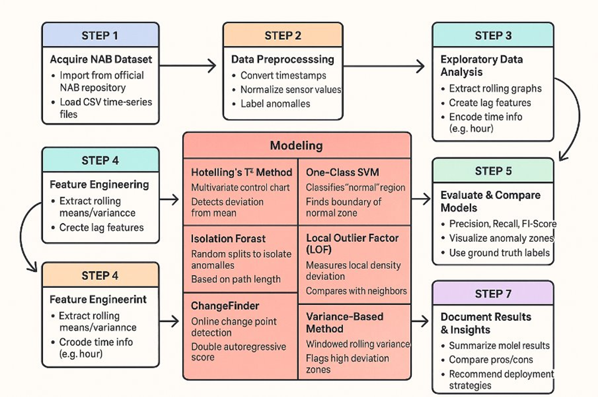
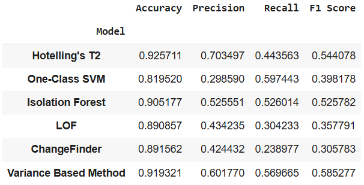
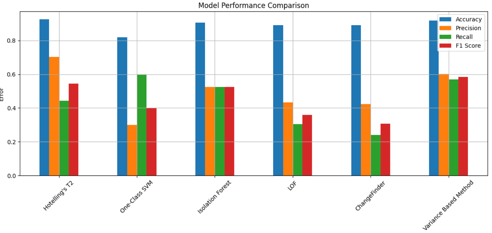

# Industrial Machine Anomaly Detection

Detecting system failures in industrial machines using statistical and unsupervised machine learning models on real-world temperature sensor data.

## 📌 Project Overview

This project uses the **Numenta Anomaly Benchmark (NAB)** dataset — specifically the `machine_temperature_system_failure.csv` file — to detect anomalies (such as system failure) in industrial machine temperature readings over time.

## 📂 Dataset Description

| Attribute         | Description                                                   |
|------------------|---------------------------------------------------------------|
| **Source**        | Numenta Anomaly Benchmark (NAB)                               |
| **File Used**     | `machine_temperature_system_failure.csv`                      |
| **Data Type**     | Real-world time-series (temperature sensor readings)          |
| **Columns**       | `timestamp`, `value`                                          |
| **Label Source**  | Anomaly intervals (from NAB's associated label files)         |
| **Sampling Rate** | ~1 reading per minute                                         |
| **Objective**     | Detect the failure event using temperature trend anomalies     |

## 🧠 Methodology



## 🤖 Models Used

| **Model**                   | **Purpose**                                                                 | **Strength**                                                                 |
|-----------------------------|------------------------------------------------------------------------------|------------------------------------------------------------------------------|
| **Hotelling’s T²**          | Multivariate anomaly detection using statistical distance                   | Detects deviations from multivariate mean; effective for correlated features |
| **One-Class SVM**           | Learns boundary around normal data to detect outliers                       | Works well with high-dimensional data; non-linear boundaries                 |
| **Isolation Forest**        | Randomly partitions data to isolate anomalies                               | Fast, scalable; interprets anomalies as easier to isolate                    |
| **Local Outlier Factor (LOF)** | Detects local density deviations between neighbors                       | Captures context-based outliers; robust to local variations                 |
| **ChangeFinder**            | Detects change points in time series using double AR modeling               | Effective for sequential change detection in time series                    |
| **Variance-Based Method**   | Flags anomalies based on sudden changes in rolling variance                 | Simple, interpretable; highlights volatility anomalies                      |

## 📊 Model Comparison





## 🛠️ How to Run

1. Clone the repo:
    ```bash
    https://github.com/addittidas/Industrial-Anomaly-Detection.git
    cd Industrial-Anomaly-Detection
    ```

2. Download dataset from Kaggle:
    ```bash
    https://www.kaggle.com/datasets/boltzmannbrain/nab?resource=download
    ```

3. Run the notebook (here, Google Colab is used).

## 📜 License
This project is licensed under the MIT License - see the LICENSE file for details.